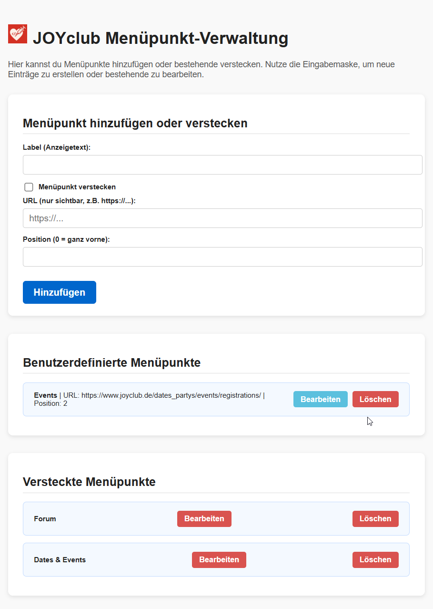

<p align="center">
  
</p>

# JOYclub Menu Injector

**JOYclub Menu Injector** ist eine Chrome-Erweiterung, mit der du das Navigationsmenü auf [joyclub.de](https://www.joyclub.de) individuell anpassen kannst.

## 🔧 Funktionen

- ➕ **Eigene Menüpunkte einfügen**  
  Füge Links zu häufig genutzten Seiten oder externen Ressourcen direkt ins JOYclub-Menü ein.

- 🙈 **Bestehende Menüpunkte ausblenden**  
  Blende Menüeinträge aus, die du nicht benötigst, um das Menü übersichtlicher zu gestalten.

- ✏️ **Bearbeiten & Entfernen**  
  Jeder hinzugefügte oder ausgeblendete Menüpunkt kann jederzeit geändert oder entfernt werden.

## ⚙️ Installation

1. Repository herunterladen

2. In Chrome öffnen:
   - `chrome://extensions/` aufrufen
   - „Entwicklermodus“ aktivieren (oben rechts)
   - Auf „Entpackte Erweiterung laden“ klicken
   - Den Projektordner auswählen

3. Seite [joyclub.de](https://www.joyclub.de) öffnen – deine Menüanpassungen werden automatisch übernommen.

## 📄 Dateistruktur

```
joyclub-menu-injector/
├── manifest.json         # Chrome-Erweiterungs-Konfiguration
├── content.js            # Fügt Menüänderungen auf der Seite ein
├── icon.png              # Icon
├── options.html          # Einstellungsseite der Erweiterung
├── options.js            # Logik der Einstellungsseite
```
<p align="center">
  
</p>
## 📝 Lizenz

MIT License – kostenlos für private und kommerzielle Nutzung.

---

**Hinweis:** Diese Erweiterung steht in keiner Verbindung zu JOYclub.de oder der F&P GmbH.
